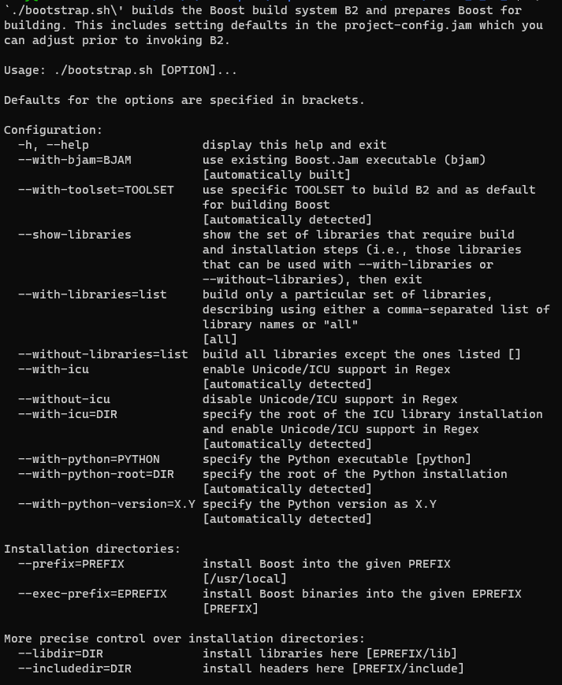
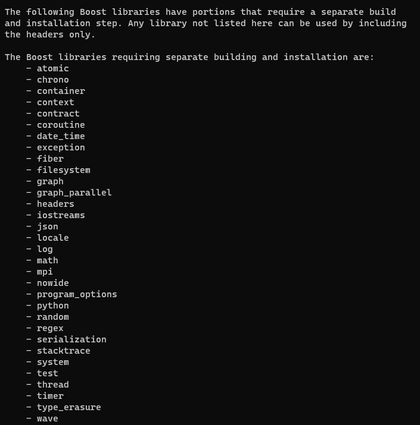
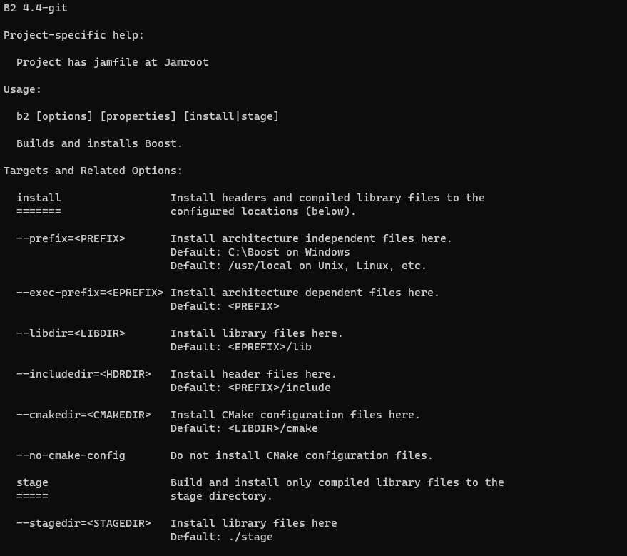
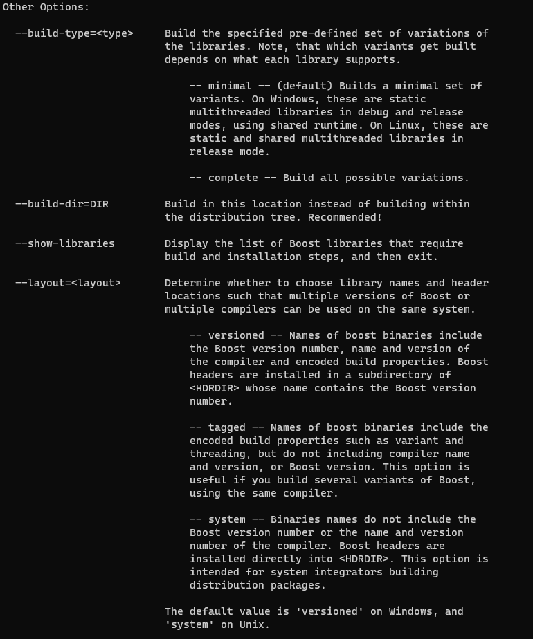
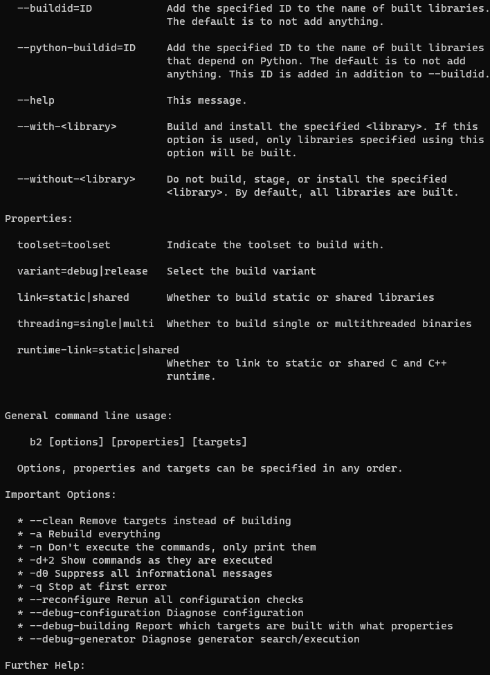
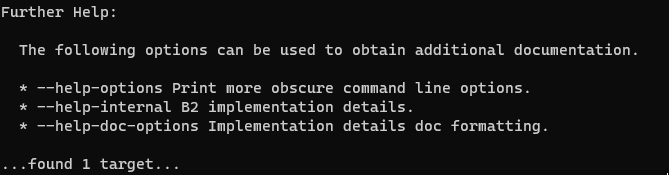

## linux编译安装boost

```
./bootstrap.sh --help
```



```
./bootstrap.sh --show-libraries
```




1. ```
   ./bootstrapsh
   ```

2. ``` 
   ./b2 --help
   ```

   

   

   

   

3. install or stage

   + install: 会拷贝头文件并编译所有库 (会在linux目录下生成include、lib子目录)

   ```
   ./b2 --prefix=../linux --build-dir=../linux install
   ```

   + stage: 只会编译库（只会生成lib目录）

   ```
   ./b2 --stagedir=../linux --build-dir=../linux stage
   ```

   


