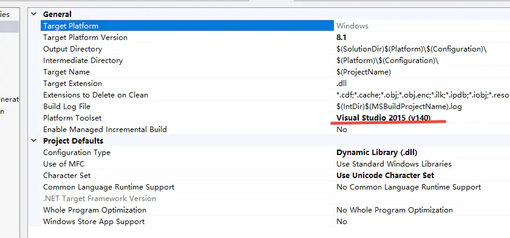
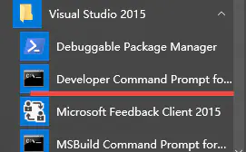
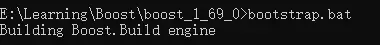
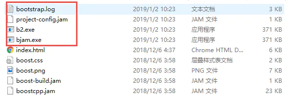
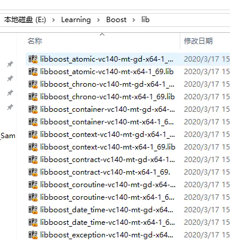
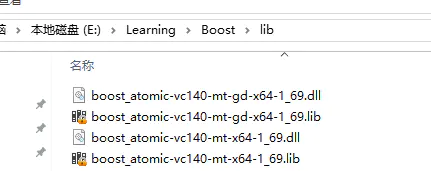
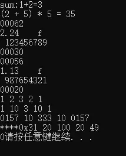

# 下载

- 下载相应版本的boost源码包：[https://www.boost.org/users/history/](https://links.jianshu.com/go?to=https%3A%2F%2Fwww.boost.org%2Fusers%2Fhistory%2F)
- 解压到想放到的路径，例如：E:\Learning\Boost\boost_1_69_0\


# 编译

- **查看VS版本（即编译器版本）**

打开任意VS工程：**VS->Project->Properties::Genneral::Plateform Toolset(VS2015为v140)**



- **打开VS的命令行窗口**

在开始菜单的VS菜单项里打开“**Developer Command Prompt for VS2015**”，进入boost目录



- **命令行窗口执行bootstrap.bat**

  

命令行运行**bootstrap.bat**，会在根目录下生产**bjam.exe**，**b2.exe**(bjam的升级版)，**project-config.jam**，**bootstrap.log**四个文件



- **命令行窗口使用bjam编译所需的boost库**

```cpp
//示例-编译除boost::python库之外的boost库
bjam stage --toolset=msvc-14.0 --without-python --stagedir="E:\Learning\Boost" link=static runtime-link=shared threading=multi address-model=64
```

会在E:\Learning\Boost下生成一个lib目录，目录里是编译好的boost的lib库



## bjam编译参数说明

**stage/install**:stage表示只生成库，install还会生成包含头文件的include目录，但编译时间较长；默认是stage。

**--stagedir/prefix**：stage时使用stagedir，**install时使用prefix**，表示编译生成文件的路径。

```swift
bjam install --toolset=msvc-14.0 --without-python --prefix="E:\Learning\Boost" link=static runtime-link=shared threading=multi address-model=64
```

**--build-type:**complete 编译所有boost库；默认complete。

```tsx
bjam stage --toolset=msvc-14.0 --build-type=complete --stagedir="E:\Learning\Boost" link=static runtime-link=shared threading=multi address-model=64
```

**--without/with**：选择不编译/编译哪些库。默认是全部编译。

**查看boost包含库的命令是bjam --show-libraries**

```dart
//boost::python lib
bjam stage --toolset=msvc-14.0  --with-python --stagedir="E:\Learning\Boost" link=static threading=multi address-model=64
```

**--toolset**：指定编译器，可选的如borland、gcc、msvc-14.0（VS2025）等。

**link**：生成动态链接库/静态链接库。

- static只会生成lib文件。
- shared会生成lib文件和dll文件。

```go
bjam stage --toolset=msvc-14.0 --build-type=complete --stagedir="E:\Learning\Boost" link=shared runtime-link=shared threading=multi address-model=64
```



**runtime-link**：动态/静态链接C/C++运行时库。同样有shared和static两种方式。

**threading**：单/多线程编译。现在基本都是multi方式了。

**address-model**：64位平台还是32位平台，不填就两种平台的库都会编译。

**debug/release**：debug版本，release版本，不填就两种版本的库都会编译。

```dart
bjam stage --toolset=msvc-14.0  --with-atomic --stagedir="E:\Learning\Boost" link=static threading=multi address-model=64 debug
```

## boost库的命名特点

```cpp
//link=static runtime-link=shared
libboost_atomic-vc140-mt-gd-x64-1_69.lib
libboost_atomic-vc140-mt-x64-1_69.lib
//link=static runtime-link=static
libboost_atomic-vc140-mt-sgd-x64-1_69.lib
libboost_atomic-vc140-mt-s-x64-1_69.lib
//link=shared runtime-link=shared
boost_atomic-vc140-mt-gd-x64-1_69.dll
boost_atomic-vc140-mt-gd-x64-1_69.lib
boost_atomic-vc140-mt-x64-1_69.dll
boost_atomic-vc140-mt-x64-1_69.lib
```

**开头_库名称-编译器版本-[多线程]-[static版本][debug版本]-平台-版本号**

**开头**：以“lib”开头的是“link=static”版本（静态链接库版本，没有dll），而直接以“boost”开头的是“link=shared”版本（动态链接库版本，包含lib和dll）。

**库名称**：其后的是boost库名称（比如date_time库）。

**编译器的版本：**与库名称之间以"-"而不是下划线"_"分隔（比如 -vc140）。

**[多线程]**：有“mt”的为“threading=multi”版本，没有该项则是“threading=single”版本。

**[static版本]**：有“s”的为“runtime-link=static”版本，没有该项则是“runtime-link=shared”版本。

**[debug版本]**：有“gd”的为debug版本，没有的则是release版本。

**平台**：x64或x32

**版本号**：所有的库都含有boost库的版本号结尾

## link参数和runtime-link的组合

| link   | runtime-link | 运行要求                                                     | 应用工程设置 |
| :----- | :----------- | :----------------------------------------------------------- | :----------- |
| static | static       | libboost_atomic-vc140-mt-sgd-x64-1_69.lib  libboost_atomic-vc140-mt-s-x64-1_69.lib | /MTd/MT      |
| static | shared       | libboost_atomic-vc140-mt-gd-x64-1_69.lib  libboost_atomic-vc140-mt-x64-1_69.lib | /MDd/MD      |
| shared | shared       | boost_atomic-vc140-mt-gd-x64-1_69.dll  boost_atomic-vc140-mt-gd-x64-1_69.lib  boost_atomic-vc140-mt-x64-1_69.dll  boost_atomic-vc140-mt-x64-1_69.lib |              |
| shared | static       | 没有这种组合                                                 |              |

### # VS工程的使用配置

- VS建立win32的console工程
- 工程设置-Properties（当前solution）
  - VC++ Directories::Include Diretorise加上boost根目录
  - VC++ Directories::Library Diretoties加上boost编译出来的lib目录
- $\color{red} {如果使用静态方式连接boost::python和boost::numpy库，需要在include这两个模块之前加上静态标识}$

```cpp
#define BOOST_PYTHON_STATIC_LIB
#define BOOST_NUMPY_STATIC_LIB
#include <boost/python.hpp>
#include <boost/python/numpy/ndarray.hpp>
```

```cpp
#include <iostream>
#include <boost/format.hpp>
#include <iomanip>


int main()
{
    std::cout << boost::format("%s:%d+%d=%d\n") % "sum" % 1 % 2 % (1 + 2);

    boost::format fmt("(%1% + %2%) * %2% = %3%\n");
    fmt % 2 % 5 %((2+5)*5);
    std::cout << fmt.str();

    fmt.parse("%|05d|\n%|-8.3|f\n%| 10S|\n%|05X|\n");
    std::cout << fmt % 62 % 2.236 % "123456789" % 48;

    fmt.clear();  
    //std::cout << fmt.str();  //error after call clear function
    std::cout << fmt % 56 % 1.125 % "987654321" % 32;

    boost::format fmtPro("%1% %2% %3% %2% %1% \n");
    std::cout << fmtPro % 1 % 2 % 3;

    fmtPro.bind_arg(2, 10);
    std::cout << fmtPro % 1 % 3;

    fmtPro.clear();
    std::cout << fmtPro % boost::io::group(std::showbase, std::oct, 111) % 333;

    fmtPro.clear_binds();
    fmtPro.modify_item(1, boost::io::group(std::hex, std::right, std::showbase, std::setw(8), std::setfill('*')));
    std::cout << fmtPro % 49 % 20 % 100;

    std::cout << 1 / 2;

    return 0;
}
```




reference:

​	https://www.jianshu.com/p/908c962aaf80

