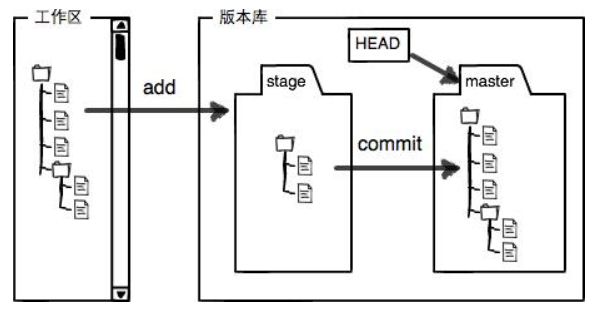
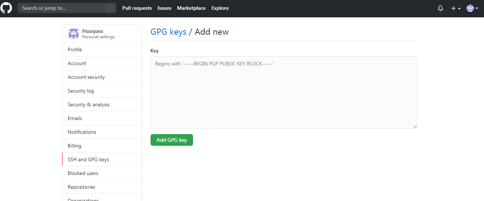
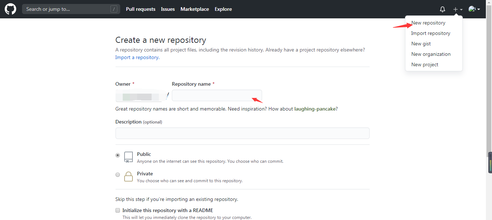
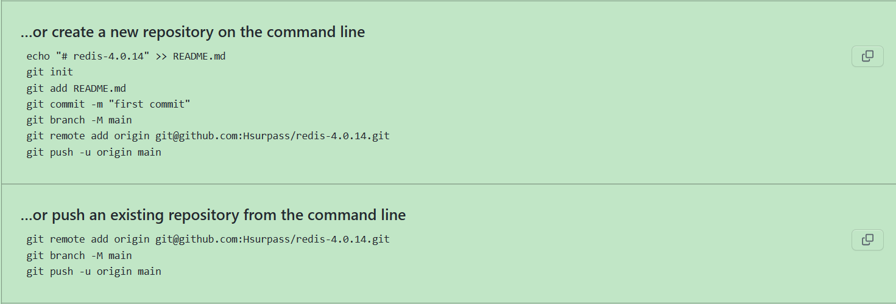
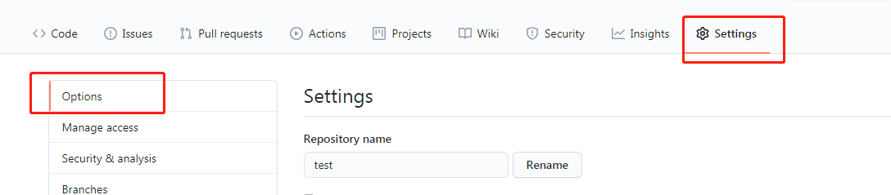
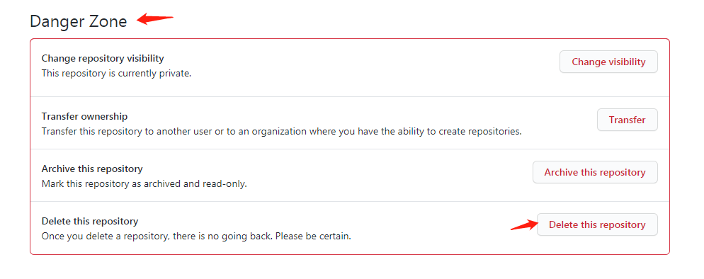

# Git

[TOC]

## 设置name和email

`git config  -–global user.name “Your Name”`

`git config –global user.email “Your Email”`

## 查看name 和 email
`git config --global --list (-l)`

`git config --local -l`

`git config --system -l`

`git config --global user.name`

`git config --global user.email`

## 初始化git仓库

`git init`

## 查看仓库状态

`git status`

## 添加工作区文件到暂存区

`git add .`

## 提交暂存区文件到本地仓库

`git commit  -m  “message”`

`-m`:后面输入的是本次提交的说明

-amend: 覆盖上次提交

## 查看修改的地方

`git diff`

 `git diff HEAD -- readme.txt` 

## 查看日志

`git log`

 如果嫌输出信息太多，看得眼花缭乱的，可以试试加上`--pretty=oneline`参数：

`git log –pretty=oneline`

```
$ git log --pretty=oneline
1094adb7b9b3807259d8cb349e7df1d4d6477073 (HEAD -> master) append GPL
e475afc93c209a690c39c13a46716e8fa000c366 add distributed
eaadf4e385e865d25c48e7ca9c8395c3f7dfaef0 wrote a readme file
```

 需要友情提示的是，你看到的一大串类似`1094adb...`的是`commit id`（版本号）。

显示5行

`git log --online -5`

显示某个提交者

`git log --online --author ="xxx"`

搜寻某个显示：

`git log --oneline –-grep='xxx'`

显示某个时间之前的log:

`git log --before='2022-01-30 --after='2022-01-01 --oneline' `

`git log --oneline --before='2020-01-01'`

`git log --oneline --before='1 week'` // 查找一周之前的log

`git log --oneline --before='3 days'`

显示图形化:

`git log --graph`

## 回退版本

`git reset –-hard head^` or `git reset —-hard commit Id` 

head^ 代表上一个版本，head^^代表上上个版本，网上100个版本head~100。

## 查看执行的每一次命令

`git reflog`

## 工作区、暂存区、版本库

工作区有一个隐藏目录`.git`，这个不算工作区，而是Git的版本库。

Git的版本库里存了很多东西，其中最重要的就是称为stage（或者叫index）的暂存区，还有Git为我们自动创建的第一个分支`master`，以及指向`master`的一个指针叫`HEAD`。



## 丢弃工作区的修改

`git restore readme.txt` (新)

`git checkout —- readme.txt` (新版本好像废弃了)

命令git checkout(restore) -- readme.txt意思就是，把`readme.txt`文件在工作区的修改全部撤销，这里有两种情况：

一种是`readme.txt`自修改后还没有被放到暂存区，现在，撤销修改就回到和版本库一模一样的状态；

一种是`readme.txt`已经添加到暂存区后，又作了修改，现在，撤销修改就回到添加到暂存区后的状态。

总之，就是让这个文件回到最近一次`git commit`或`git add`时的状态。

 `git checkout -- file`命令中的`--`很重要，没有`--`，就变成了“切换到另一个分支”的命令 。

## 撤销暂存区到工作区

`git reset head readme.txt` OR

`git restore --staged readme.txt`（新）

 `git reset`命令既可以回退版本，也可以把暂存区的修改回退到工作区。当我们用`HEAD`时，表示最新的版本。 

## 分支

创建分支`git branch dev`

切换分支： `git checkout dev`

创建并切换分支：`git checkout -b dev`

删除分支：`git branch -d dev`

强制删除分支：`git branch -D dev`

删除远程分支： `git branch -d -r/--remotes origin/dev `

## 删除文件

`git rm readme.txt`

`git commit -m …..`

## 远程仓库

### .创建SSHkey

创建SSH Key。在用户主目录下，看看有没有.ssh目录，如果有，再看看这个目录下有没有`id_rsa`和`id_rsa.pub`这两个文件，如果已经有了，可直接跳到下一步。如果没有，打开Shell（Windows下打开Git Bash），创建SSH Key：

```
$ ssh-keygen -t rsa -C "youremail@example.com"
```

你需要把邮件地址换成你自己的邮件地址，然后一路回车，使用默认值即可，由于这个Key也不是用于军事目的，所以也无需设置密码。

如果一切顺利的话，可以在用户主目录里找到`.ssh`目录，里面有`id_rsa`和`id_rsa.pub`两个文件，这两个就是SSH Key的秘钥对，`id_rsa`是私钥，不能泄露出去，`id_rsa.pub`是公钥，可以放心地告诉任何人。

### .添加 ssh key

 登陆Github，打开“Account settings”，“SSH Keys”页面：

然后，点“Add SSH Key”，填上任意Title，在Key文本框里粘贴`id_rsa.pub`文件的内容：



为什么GitHub需要SSH Key呢？因为GitHub需要识别出你推送的提交确实是你推送的，而不是别人冒充的，而Git支持SSH协议，所以，GitHub只要知道了你的公钥，就可以确认只有你自己才能推送。

当然，GitHub允许你添加多个Key。假定你有若干电脑，你一会儿在公司提交，一会儿在家里提交，只要把每台电脑的Key都添加到GitHub，就可以在每台电脑上往GitHub推送了。

### .把本地仓库上传到远程

#### 	.创建远程仓库




#### .本地仓库关联远程仓库

```
git remote add origin git@github.com:XXXX/XXX.git
```

####  .本地库的内容推送到远程库

`git push -u origin master`

把本地库的内容推送到远程，用`git push`命令，实际上是把当前分支`master`推送到远程。

由于远程库是空的，我们第一次推送`master`分支时，加上了`-u`参数，Git不但会把本地的`master`分支内容推送的远程新的`master`分支，还会把本地的`master`分支和远程的`master`分支关联起来，在以后的推送或者拉取时就可以简化命令。



### .删除远程仓库




