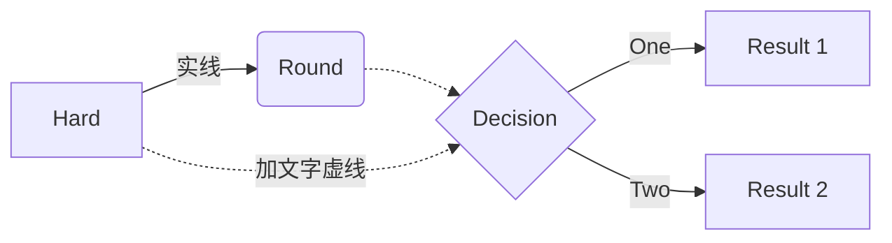
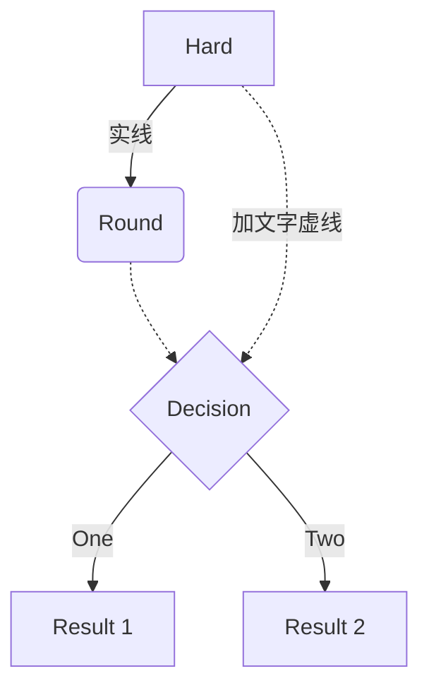
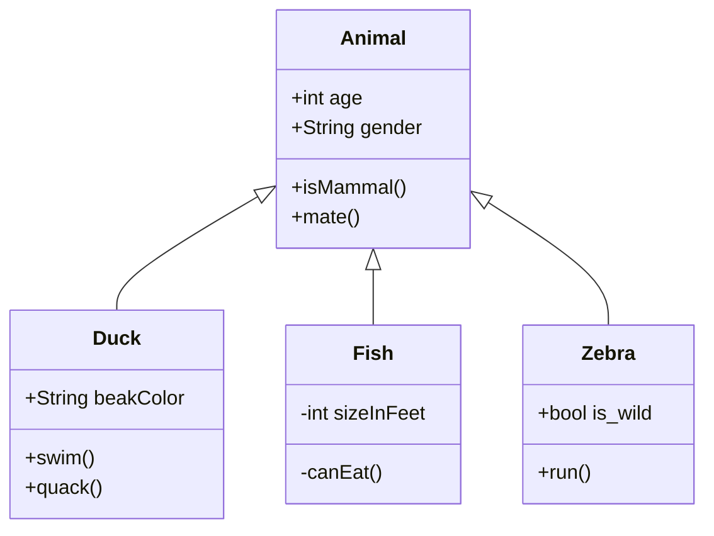
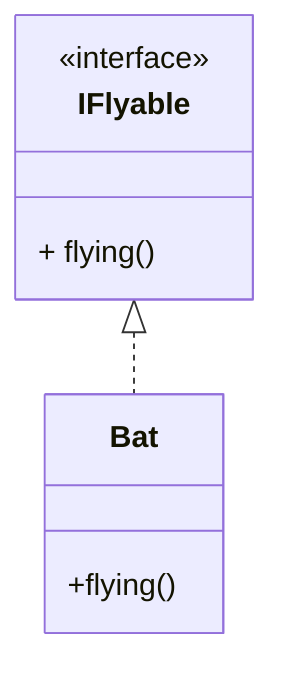
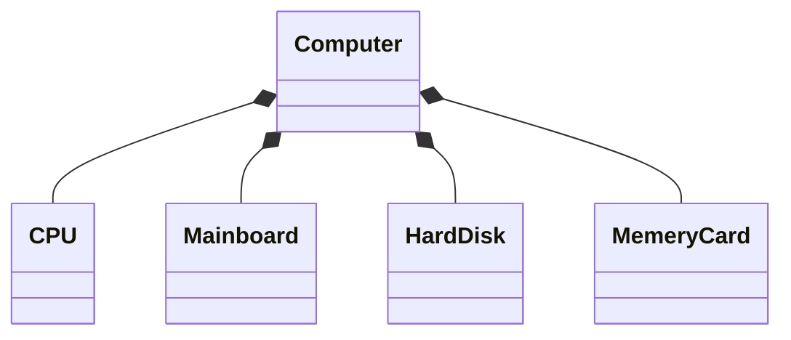
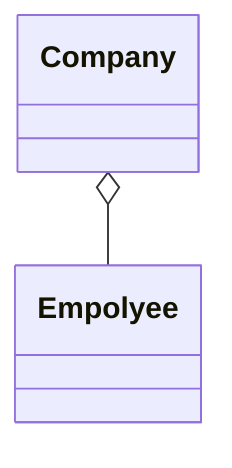
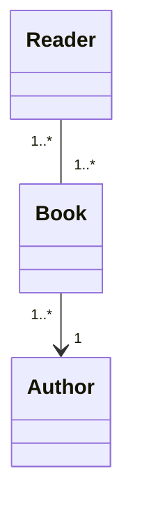
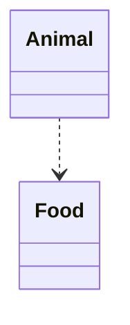
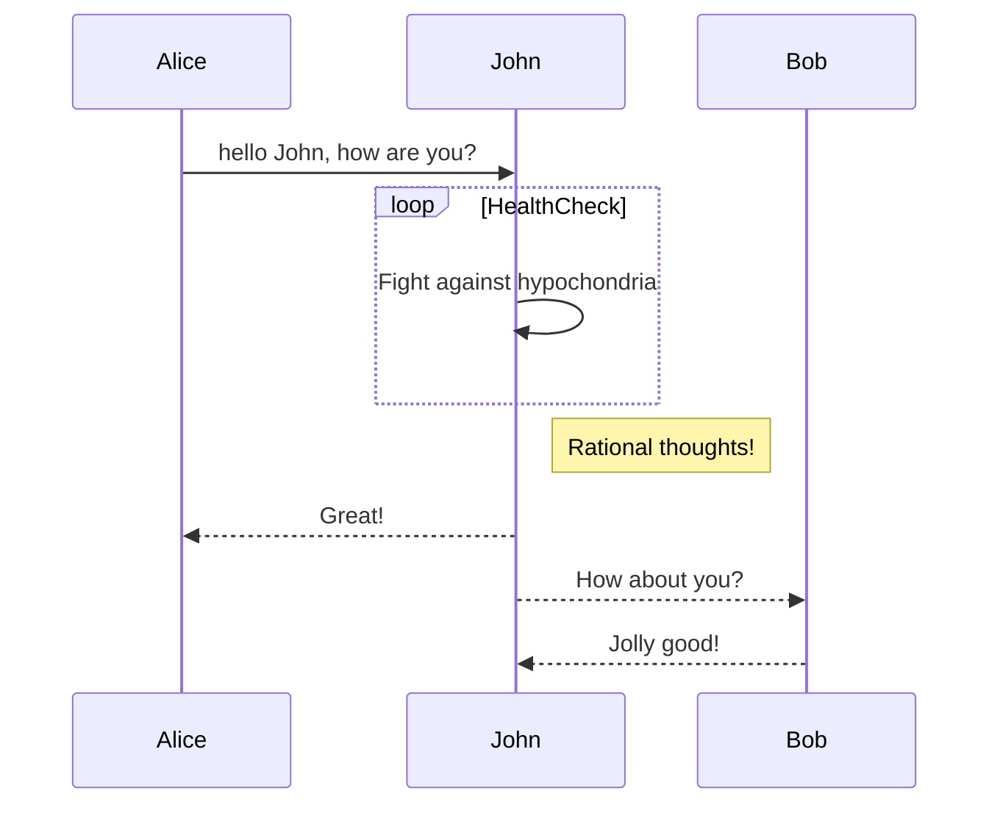

流程图实例，

流程图分成多种方向：

- TB-从上到下
- TD-自顶向下/从上至下相同
- BT-从下到上
- RL-从右到左
- LR-从左到右

-------------

类图实例【泛化，继承关系，子类与父类】

实现实例【类与接口的关系】，不过Typora的接口没有使用虚线

组合实例【整体与部分的关系，部分不能离开整体】

聚合实例【整体与部分的关系，部分可以离开整体单独存在】

关联实例【一种拥有关系，一个类知道另一个类的属性和方法，弱相关，但是不从属不包含】

依赖实例【一种使用关系，一个类的实现需要另一个类的协助】

------------------

时序图实例

