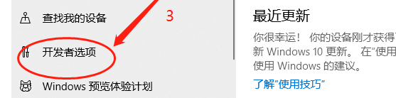
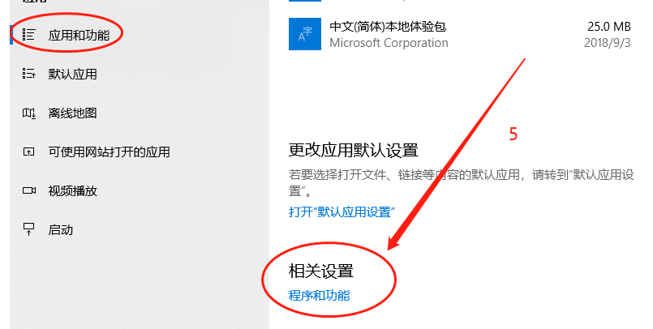
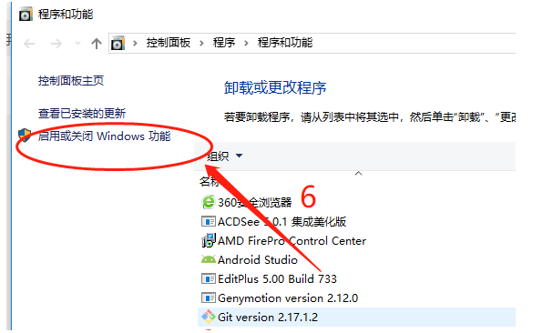
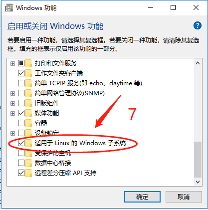
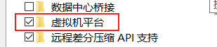

# 新版安装wsl2

`win + r` 输入winver查看windows版本

新版安装很方便：

以==管理员方式==打开powershell, 输入`wsl --install` 默认安装的就是ubuntu。

安装其他分发版可以输入`wsl --install -d <debian>`。

```bash
wsl -l -o : 查看可以安装的版本。
wsl -l -v : 查看正在运行的wsl版本。
wsl --update : 更新WSL Linux kernel。
wsl --status : 查看WSL配置的一般信息，例如默认发行版类型、默认发行版和内核版本。
wsl --unregister <DistributionName> : 注销并卸载 WSL 发行版, 例如: wsl --unregister Ubuntu
```

## references:

[基本WSL命令](https://learn.microsoft.com/zh-cn/windows/wsl/basic-commands)

[安装WSL](https://learn.microsoft.com/zh-cn/windows/wsl/install)

[install WSL](https://learn.microsoft.com/en-us/windows/wsl/install)

[Install WSL with a single command now available in Windows 10 version 2004 and higher](https://devblogs.microsoft.com/commandline/install-wsl-with-a-single-command-now-available-in-windows-10-version-2004-and-higher/)

# 分步或旧版安装wsl2









这步对应步骤1



这步对应步骤3



## references:

[旧版本的手动安装步骤](https://learn.microsoft.com/zh-cn/windows/wsl/install-manual)

[Manual installation steps for older versions of WSL](https://learn.microsoft.com/en-us/windows/wsl/install-manual)

[Windows 10 更新助手](https://support.microsoft.com/zh-cn/topic/windows-10-%E6%9B%B4%E6%96%B0%E5%8A%A9%E6%89%8B-3550dfb2-a015-7765-12ea-fba2ac36fb3f)


wsl2 ping不通 宿主机：

https://www.jianshu.com/p/ba2cf239ebe0

http://www.fangyuba.com/news/dynamic/436.htm

https://www.it1352.com/2346793.html

https://www.it1352.com/2237644.html


wsl2配置ssh

https://zhuanlan.zhihu.com/p/391283691


更改wsl系统中的文件权限

http://zuyunfei.com/2018/06/15/file-system-configuration-in-wsl/


