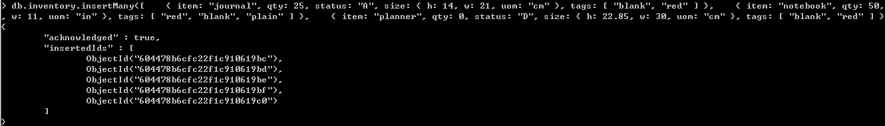
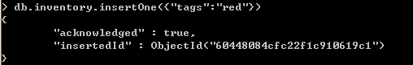
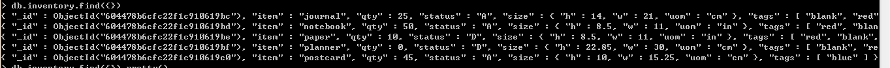
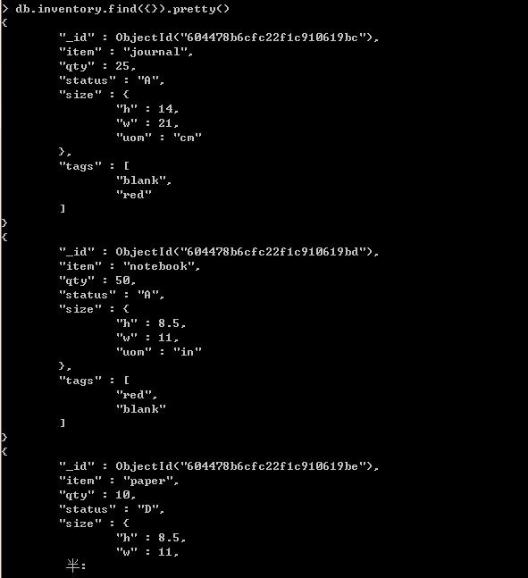
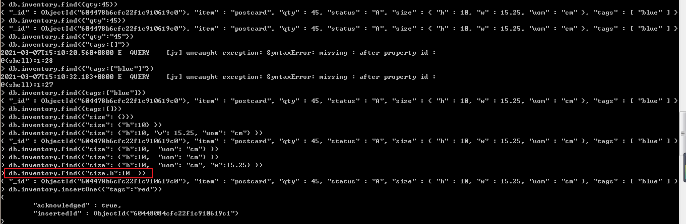
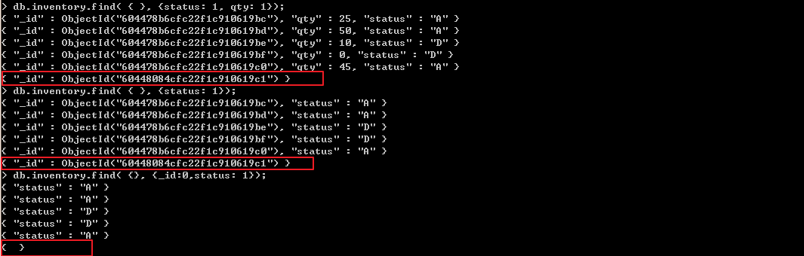

- **创建数据库**


- **删除数据库**


- **切换数据库**

  `use db`

- **显示当前所使用的数据库**

  `db`

  

- **显示所有数据库**

  `show dbs`

  

- **创建集合**

    `db.createCollection()`


- **删除集合**


- **显示集合**

  `show collections`


- **查看集合信息**

  `db.getCollectionInfos()`

  


- 插入文档

  `db.collections.insertMany()`
  
  ```
  db.inventory.insertMany([
     { item: "journal", qty: 25, status: "A", size: { h: 14, w: 21, uom: "cm" }, tags: [ "blank", "red" ] },
     { item: "notebook", qty: 50, status: "A", size: { h: 8.5, w: 11, uom: "in" }, tags: [ "red", "blank" ] },
     { item: "paper", qty: 10, status: "D", size: { h: 8.5, w: 11, uom: "in" }, tags: [ "red", "blank", "plain" ] },
     { item: "planner", qty: 0, status: "D", size: { h: 22.85, w: 30, uom: "cm" }, tags: [ "blank", "red" ] },
     { item: "postcard", qty: 45, status: "A", size: { h: 10, w: 15.25, uom: "cm" }, tags: [ "blue" ] }
]);
  ```
  
  
  
  `db.collections.insertOne()`




- 删除文档


- 查找文档

  `db.collections.find({})`

  
  
  `db.collections.find({}).pretty()`
  
  
  
  
  
  `db.find({}, {_id: 0 | 1, key:1,key:1})`
  
  


- 更新文档


