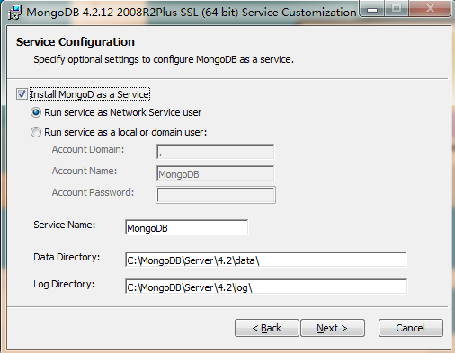
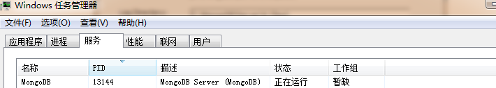
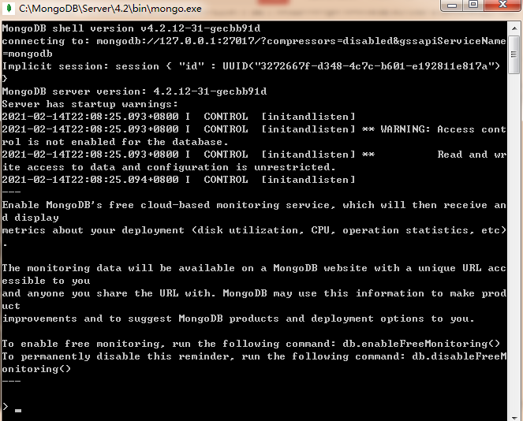

# 下载

1. **MongoDB Windows系统64位下载地址：** http://www.mongodb.org/dl/win32/x86_64

2. **MongoDB Windows系统32位下载地址：** http://www.mongodb.org/dl/win32/i386

3. **MongoDB 全部版本下载地址：** http://www.mongodb.org/dl/win32

# 安装




- **如果选择了配置为Windows服务，那么此时在服务中也可以看到该服务**




+ **Run Service as Network Service user**
  这是Windows内置的Windows用户账户
  
+ **Run Services as a local or domain user**
  
  对于现有本地用户账户，Domain填"."(小数点)即可，
  
  Account Name为当前Windows用户名，
  
  Account Password为Windows用户密码（注意不是PIN密码）。
  
   对于公司用户，向管理员询问域、用户名、密码。

- **Data Directory**

  数据库文件存储路径
  
- **Log Directory**

  日志文件存储路径
  
  

# 验证安装是否成功

- **浏览器访问 `127.0.0.1:27017`**


+ **双击bin目录下的mongo.exe**

  
- **添加环境变量**

  `.......\MongoDB\Server\4.2\bin`

+ **安装compass**

  https://github.com/mongodb-js/compass/releases
  
  

# 配置文件

`mongod.cfg`


# 开启关闭卸载mongodb服务

**开启MongoDB服务**

```
net start mongodb
```

**关闭MongoDB服务**

```
net stop mongodb
```

**卸载mongodb服务**

```
sc delete mongodb
```

