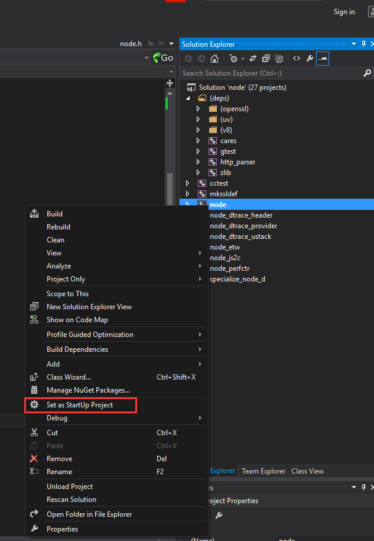

[TOC]

# Windows下编译nodejs源码

nodejs:4.9.1

target_env:vs2013

## 源码下载地址：

https://github.com/nodejs/node/releases

## 编译前准备工作：

安装python2.7：https://www.python.org/downloads/windows/

安装NASM(全称The Netwide Assembler，是一款基于80x86和x86-64平台的汇编语言编译程序)：https://www.nasm.us/pub/nasm/releasebuilds/

安装git：https://git-scm.com/downloads

## 编译NodeJs源码：

解压源码后进入node目录，`win+R`打开cmd，运行下面命令：

`vcbuild.bat nosign debug x86`

`vcbuild.bat nosign release x86`

`vcbuild.bat nosign debug x64`

`vcbuild.bat nosign release x64`

编译成功：

编译完成后，Debug和Release目录下会生成node.exe;

node文件夹下会有一个`node.sln`，双击打开它，F7编译，F5运行。

直接F5可能会出现这个问题：

设置node为启动项解决：

F5运行，理论上是会弹出一个node的REPL窗口，就是平时在cmd里面输入node指令的样子：

## REFERENCES：

https://zhuanlan.zhihu.com/p/38030900

