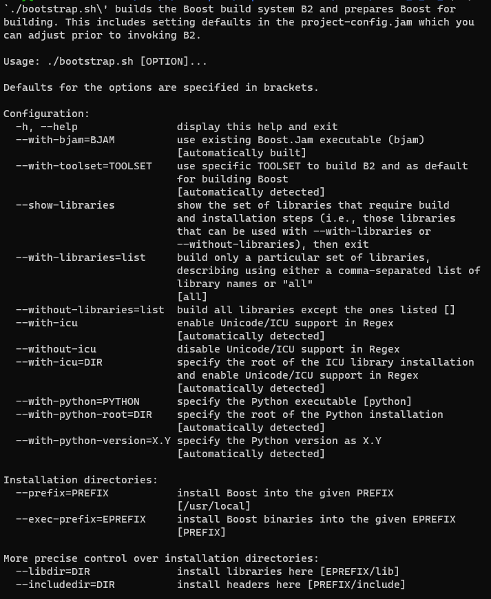
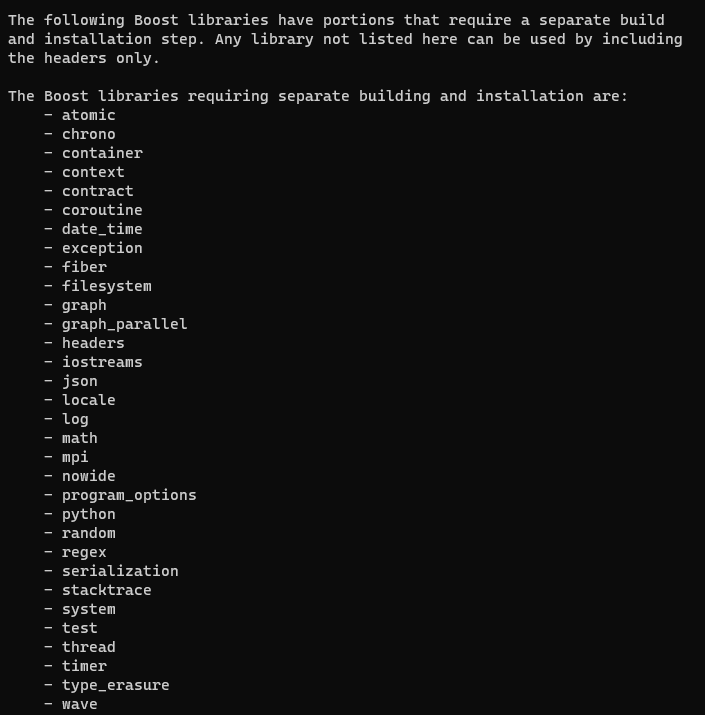
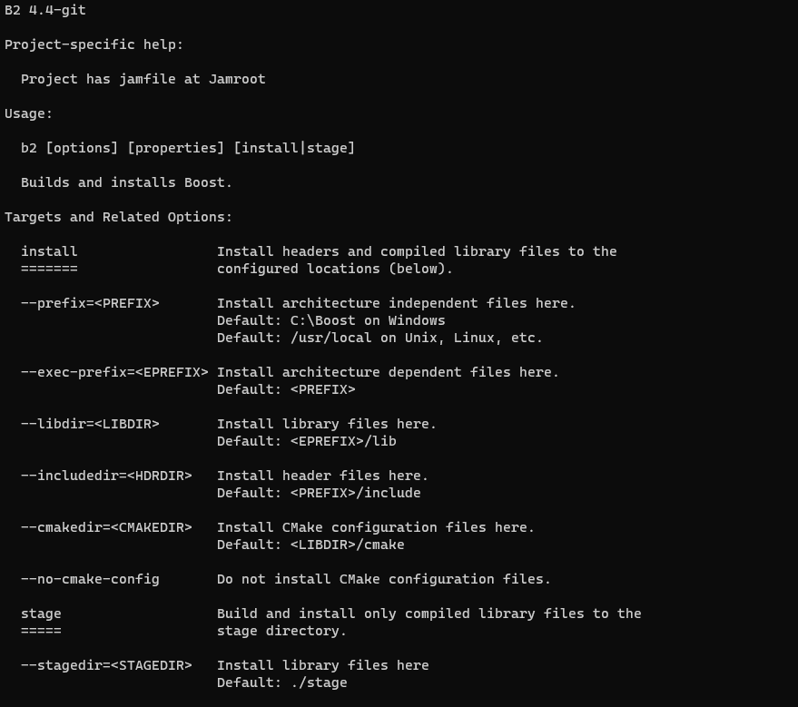
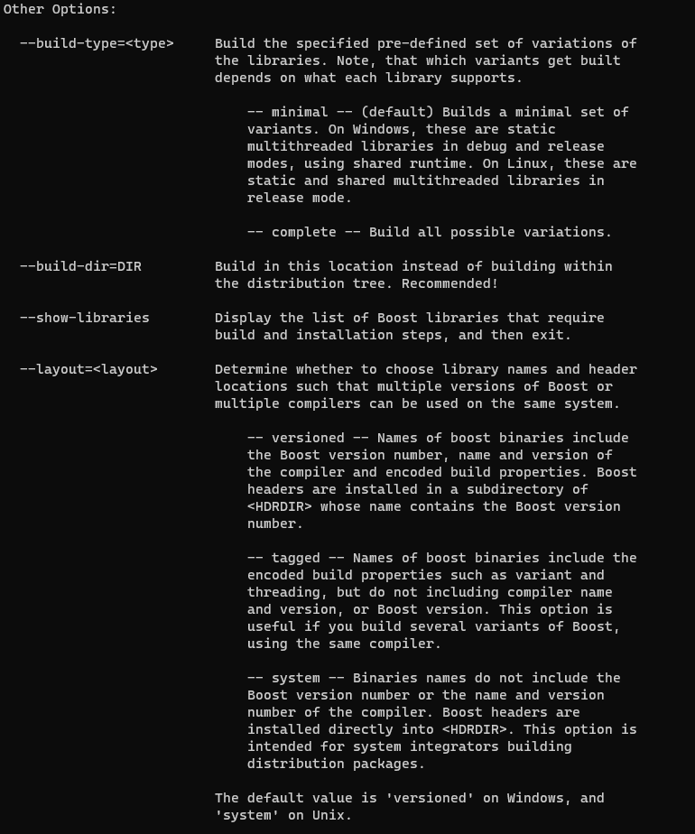
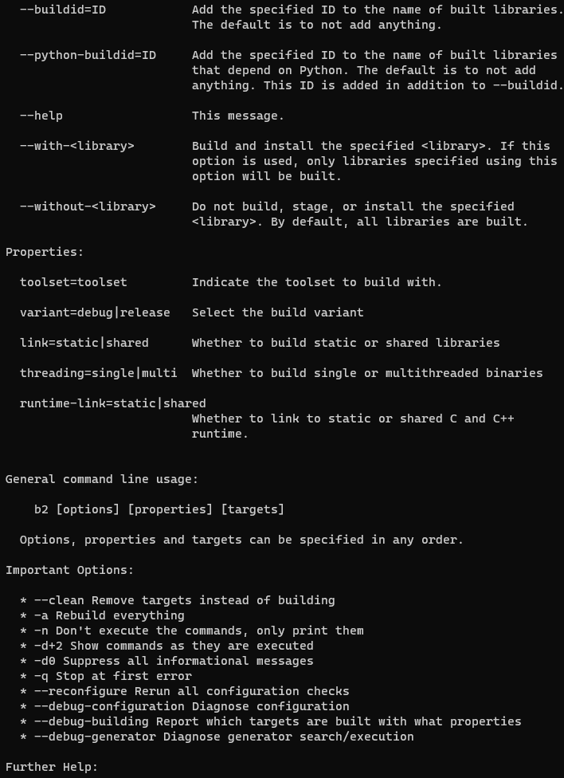
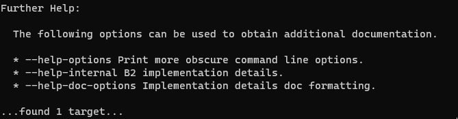

## linux编译安装boost

```
./bootstrap.sh --help
```



```
./bootstrap.sh --show-libraries
```




1. ```
   ./bootstrapsh
   ```

2. ``` 
   ./b2 --help
   ```

   

   

   

   

3. install or stage

   + install: 会拷贝头文件并编译所有库 (会在linux目录下生成include、lib子目录)

   ```bash
   ./b2 install --prefix=../linux176 --build-dir=../linux176 --without-python --no-cmake-config
   ```

   + stage: 只会编译库（只会生成lib目录）

   ```bash
   ./b2 stage --stagedir=../linux176 --build-dir=../linux176 --without-python --no-cmake-config
   ```

   

4. config

   ```bash
   vi ~/.bashrc
   
   export CPLUS_INCLUDE_PATH=/mnt/d/WorkSpace/4openSourceCode/Boost/linux176/include:$CPLUS_INCLUDE_PATH
   export LIBRARY_PATH=/mnt/d/WorkSpace/4openSourceCode/Boost/linux176/lib:$LIBRARY_PATH
   export LD_LIBRARY_PATH=/mnt/d/WorkSpace/4openSourceCode/Boost/linux176/lib:$LD_LIBRARY_PATH
   export PATH=/mnt/d/WorkSpace/4openSourceCode/Boost/linux176/:$PATH
   ```
   
   


