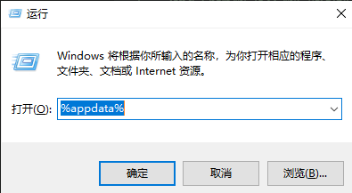

### pip

#### 安装pip

pip 官网：https://pypi.org/project/pip/

你可以通过以下命令来判断是否已安装：

```
pip --version     # Python2.x 版本命令
pip3 --version    # Python3.x 版本命令
pip -V            # 查看pip版本
```

1. 如果你还未安装，则可以使用以下方法来安装：

```
$ curl https://bootstrap.pypa.io/get-pip.py -o get-pip.py   # 下载安装脚本
$ sudo python get-pip.py    # 运行安装脚本
```

> **注意：**用哪个版本的 Python 运行安装脚本，pip 就被关联到哪个版本，如果是 Python3 则执行以下命令：
>
> ```
> $ sudo python3 get-pip.py    # 运行安装脚本。
> ```
>
> 一般情况 pip 对应的是 Python 2.7，pip3 对应的是 Python 3.x。

2. **部分 Linux 发行版可直接用包管理器安装 pip**，如 Debian 和 Ubuntu：

```
sudo apt-get install python-pip
sudo apt-get install python3-pip

sudo apt-get auto-remove python3-pip [--purge]
```

#### 升级 pip

```
pip install -U pip
sudo easy_install --upgrade pip
pip install --upgrade pip
python2 -m pip install --upgrade pip
python3 -m pip install --upgrade pip
```

#### 搜索包

```
pip search SomePackage
```

#### 安装包

```
pip install SomePackage              # 最新版本安装包（默认从国外的网站下载安装）
pip install SomePackage==1.0.4       # 指定版本
pip install 'SomePackage>=1.0.4'     # 最小版本
```

比如我要安装 Django。用以下的一条命令就可以，方便快捷。

```
pip install Django==1.7
```

#### 升级包

```
pip install --upgrade SomePackage
```

升级指定的包，通过使用==, >=, <=, >, < 来指定一个版本号。

#### 查看可升级的包

```
pip list -o
```

#### 显示安装包信息

```
pip show package        显示包详情
```

**查看指定包的详细信息**

```
pip show -f SomePackage
```

#### 卸载包

```
pip uninstall SomePackage

pip uninstall pip
python -m pip uninstall pip
```

#### 查看已安装的包

```
pip list                查看所有已安装的包
pip freeze              查看所有已安装的包（处了自带的pip，setuptools等）   
```


#### 查看源及换源

##### 永久更换镜像源

**方法一**

- windows

  1. win+r 输入%appdata%

  

  2. 定位到`C:\Users\admin\AppData\Roaming`目录下，新建pip文件夹(如果没有), 在文件夹下新建一个pip.ini文件。

  3. 在新建的 pip.ini 文件中输入以下内容，然后保存。

     ```
     [global]
     timeout = 6000
     index-url = https://mirrors.aliyun.com/pypi/simple/
     trusted-host = mirrors.aliyun.com
     ```
	
- linux

  1. 需要修改~/ .pip/pip.conf (没有就创建一个)

  2. 在pip.conf配置文件中，添加配置内容：

     ```
     [global]
     timeout = 6000
     index-url = https://mirrors.aliyun.com/pypi/simple/
     trusted-host = mirrors.aliyun.com
     ```

	```
	#查看源
  python -m pip config list
  #设置源
  python -m pip config set global.index-url 'https://mirrors.aliyun.com/pypi/simple/'
  #设置信任镜像
  python -m pip config set install.trusted-host 'mirrors.aliyun.com'
  ```

**方法二**

​		安装pqi模块

```
1、安装
pip3 install pqi

2、查看当前的源
pqi show

3、查看当前的可用源
pqi ls

4、切换源
pqi use username(如aliyun)
```

##### 临时换源

```
pip install package -i 国内源
    清华源：https://pypi.tuna.tsinghua.edu.cn/simple
    阿里源：http://mirrors.aliyun.com/pypi/simple/
    豆瓣源：https://pypi.douban.com/simple/
pip install -i https://pypi.douban.com/simple/ numpy
pip install -i https://pypi.douban.com/simple/ --trusted-host pypi.douban.com  #此参数“--trusted-host”表示信任，如果上一个提示不受信任，就使用这个
```


reference:

pqi仓库

https://github.com/yhangf/PyQuickInstall

linux下：Python2和python3共存

https://cloud.tencent.com/developer/article/2054162

windows下Python2和python3共存

https://cloud.tencent.com/developer/article/1994189

强制卸载安装pip

```
python -m pip install --upgrade pip --force-reinstall --no-warn-script-location
```

